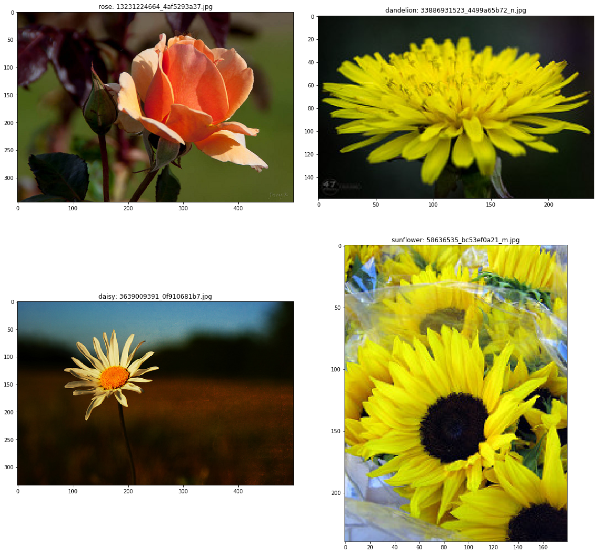
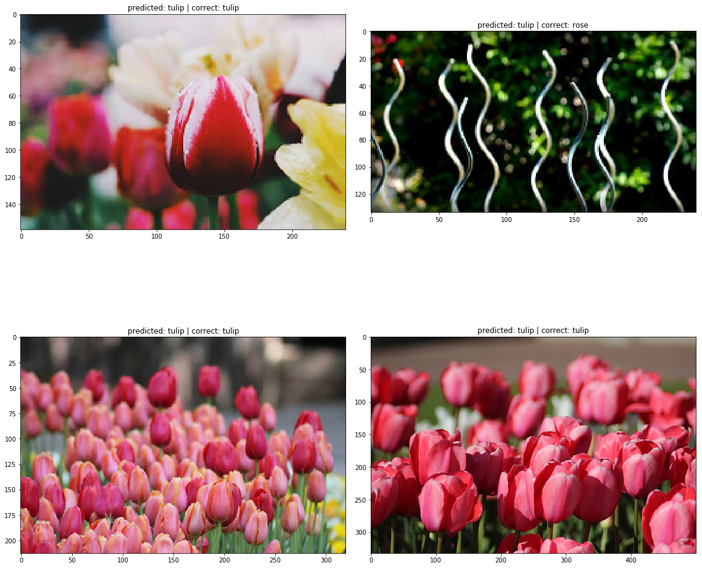
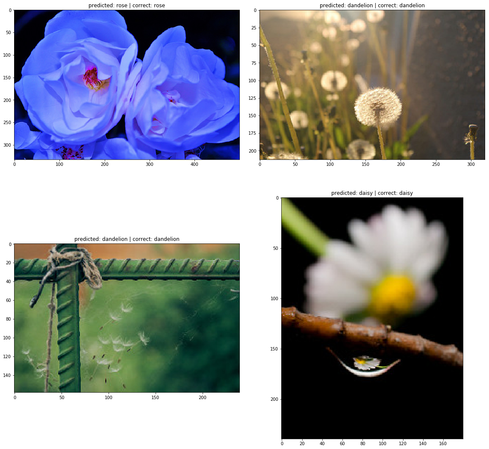
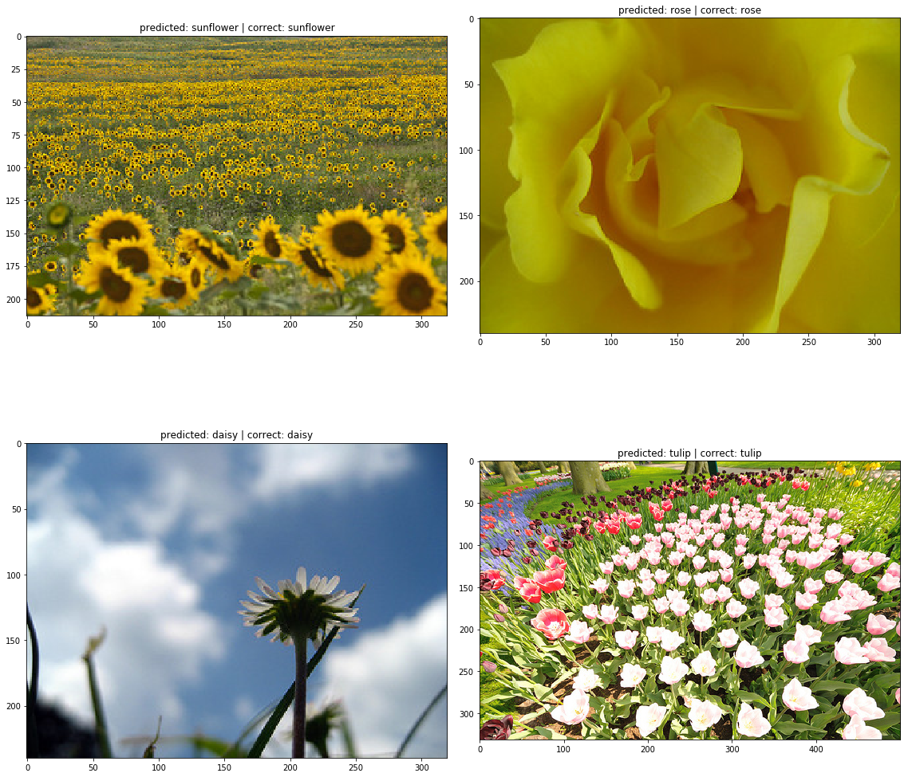

# Catalyst Classification on Flowers Dataset

**Author**: SHAILESH DHAMA

### Business problem:

To perform classification and modelling on flowers dataset.

## STEPS :

    - Requirements
    - Setting up GPUs
    - Dataset preprocessing
    - Augmentations
    - Pytorch dataloaders
    - Modelling
    - Model predictions
    - Training with Focal Loss and OneCycle
    - Model inference

## RESULTS :

#### Before Predictions :


> Dataset Description with labels.

#### After Predictions :




> Flower predictions by modelling.

### For further information

Please review the narrative of our analysis in [our jupyter notebook](./Catalyst_classification_on_Flowers_Dataset.ipynb)

For any additional questions, please contact **shaileshshettyd@gmail.com)

##### Repository Structure:

```
├── README.md                                                   <- The top-level README for reviewers of this project.
├── Catalyst_classification_on_Flowers_Dataset.ipynb            <- narrative documentation of analysis in jupyter notebook
└── images                                                      <- both sourced externally and generated from code
```

## Citing

```
@misc{Shailesh:2019,
  Author = {Shailesh Dhama},
  Title = {Catalyst-classification-on-Flowers-Dataset},
  Year = {2019},
  Publisher = {GitHub},
  Journal = {GitHub repository},
  Howpublished = {\url{https://github.com/ShaileshDhama/Catalyst-classification-on-Flowers-Dataset}}
}
```
